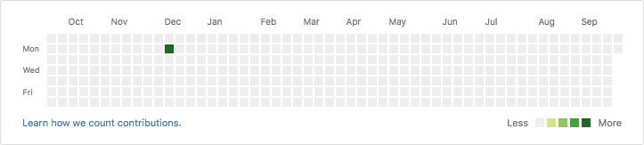
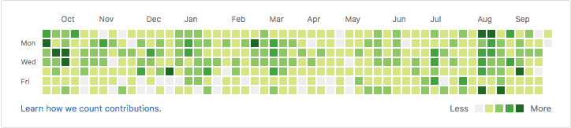

<h1 align="center">Bro-grass</h1>
<h3 align="center">🌱🌱🌱 An automatic gardener which take care of your Github Grass™ 🌱🌱🌱 </h3>

  <!-- License -->
  

##Goal

Look at this : 

Now, look at *this* : 

Bro-grass helps you keep your Github Grass™ **clean** and **green** !

##Installation
